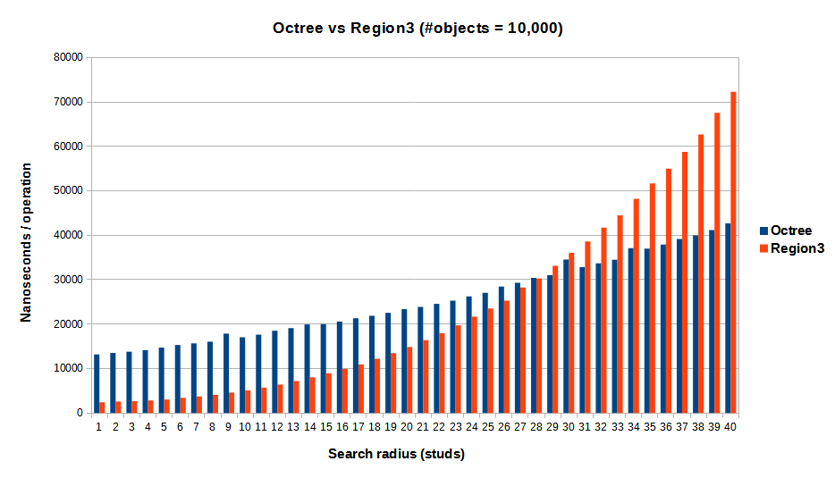
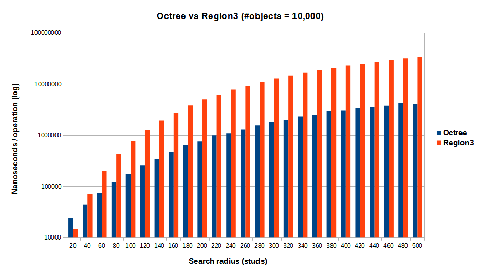
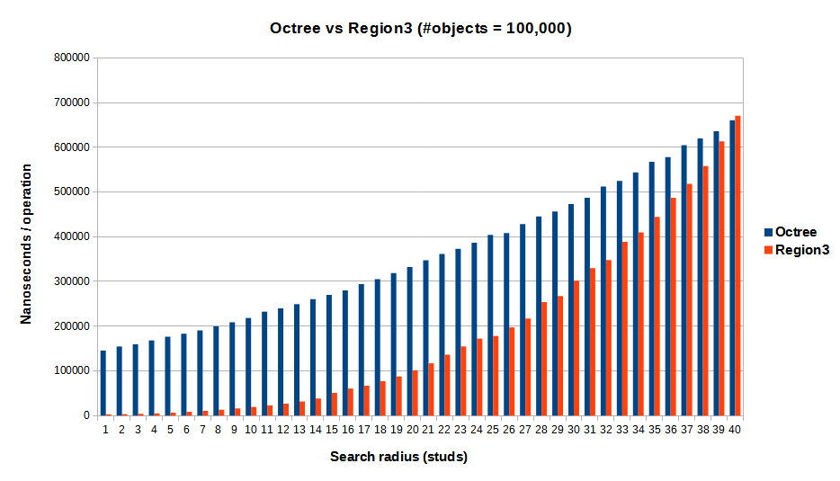
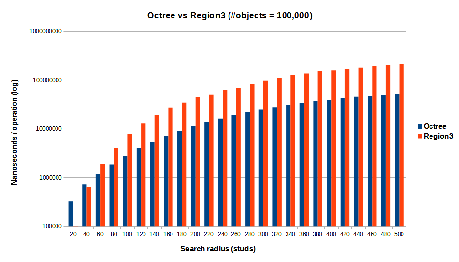

# Octree
This benchmark compares [Quenty's Octree][Octree] module with a similar
implementation that uses
[WorldRoot.FindPartsInRegion3][WorldRoot.FindPartsInRegion3].

## Background
The general sentiment with the Region3 methods is that they are egregiously
slow. Classically, the reason for this are the *descendantsTable* parameters on
the [WithIgnoreList][WorldRoot.FindPartsInRegion3WithIgnoreList] and
[WithWhiteList][WorldRoot.FindPartsInRegion3WithWhiteList] variants. They
involve reflecting a table of instances to an internal representation. For large
tables, this quickly becomes the bottleneck. Because of the design of the API,
the reflection must be done on every single call.

The Region3 methods were originally available only on the [Workspace][Workspace]
class, which meant all processes had to be done within the Workspace. This led
to *descendantsTable* being used aggressively in order to apply a particular
process only to a particular set of objects.

Moving these methods to a separate [WorldRoot][WorldRoot] class (and
[worldModel][WorldModel] in turn), is a game-changer for the Region3 methods.
WorldModels can be created and filled with objects, while being entirely
isolated from other WorldModels. For bulk objects, WorldModel effectively
replaces *descendantsTable* entirely.

## Benchmarks
The following matrix of benchmarks were run:

|                     | Small radius (1-40 studs) | Large radius (20-500 studs) |
|---------------------|---------------------------|-----------------------------|
| **10,000 objects**  | ...                       | ...                         |
| **100,000 objects** | ...                       | ...                         |

Objects are placed pseudo-randomly within a 512^3 volume. Note that the density
of objects may have a significant effect on performance, possibly more than the
number of objects, so this is another variable to consider in a future run.

### Small+10K

| Radius | Octree | Region3 | Region3/Octree |
|-------:|-------:|--------:|---------------:|
| 1      | 13171  | 2412    | 18.31%         |
| 2      | 13498  | 2578    | 19.09%         |
| 3      | 13787  | 2655    | 19.25%         |
| 4      | 14143  | 2826    | 19.98%         |
| 5      | 14706  | 3032    | 20.61%         |
| 6      | 15293  | 3408    | 22.28%         |
| 7      | 15665  | 3739    | 23.86%         |
| 8      | 16046  | 4096    | 25.52%         |
| 9      | 17859  | 4598    | 25.74%         |
| 10     | 17038  | 5093    | 29.89%         |
| 11     | 17619  | 5704    | 32.37%         |
| 12     | 18505  | 6395    | 34.55%         |
| 13     | 19096  | 7184    | 37.62%         |
| 14     | 19918  | 8028    | 40.30%         |
| 15     | 19994  | 8940    | 44.71%         |
| 16     | 20576  | 9934    | 48.27%         |
| 17     | 21306  | 10934   | 51.31%         |
| 18     | 21863  | 12197   | 55.78%         |
| 19     | 22531  | 13470   | 59.78%         |
| 20     | 23357  | 14850   | 63.57%         |
| 21     | 23868  | 16397   | 68.69%         |
| 22     | 24550  | 17975   | 73.21%         |
| 23     | 25279  | 19725   | 78.02%         |
| 24     | 26230  | 21679   | 82.64%         |
| 25     | 27037  | 23518   | 86.98%         |
| 26     | 28423  | 25275   | 88.92%         |
| 27     | 29303  | 28229   | 96.33%         |
| 28     | 30378  | 30252   | 99.58%         |
| 29     | 31012  | 33110   | 106.76%        |
| 30     | 34497  | 36021   | 104.41%        |
| 31     | 32798  | 38579   | 117.62%        |
| 32     | 33676  | 41726   | 123.90%        |
| 33     | 34493  | 44481   | 128.95%        |
| 34     | 37095  | 48191   | 129.91%        |
| 35     | 36987  | 51671   | 139.70%        |
| 36     | 37906  | 54962   | 144.99%        |
| 37     | 39161  | 58737   | 149.98%        |
| 38     | 39954  | 62662   | 156.83%        |
| 39     | 41144  | 67527   | 164.12%        |
| 40     | 42651  | 72271   | 169.44%        |

Region3 performs better for up to a search radius of around 30 studs.

### Large+10K

| Radius | Octree  | Region3  | Region3/Octree |
|-------:|--------:|---------:|---------------:|
| 20     | 23898   | 14673    | 61.39%         |
| 40     | 44537   | 70993    | 159.40%        |
| 60     | 74720   | 202183   | 270.58%        |
| 80     | 120466  | 429554   | 356.57%        |
| 100    | 176175  | 777515   | 441.33%        |
| 120    | 261582  | 1287648  | 492.25%        |
| 140    | 346686  | 1946284  | 561.39%        |
| 160    | 470963  | 2788101  | 592.00%        |
| 180    | 634869  | 3830252  | 603.31%        |
| 200    | 755325  | 5045372  | 667.97%        |
| 220    | 998210  | 6182918  | 619.40%        |
| 240    | 1094999 | 7806517  | 712.92%        |
| 260    | 1311435 | 9301952  | 709.29%        |
| 280    | 1552079 | 11115433 | 716.16%        |
| 300    | 1834231 | 12979383 | 707.61%        |
| 320    | 1995282 | 14854868 | 744.49%        |
| 340    | 2347558 | 16670133 | 710.10%        |
| 360    | 2537731 | 18738494 | 738.39%        |
| 380    | 2981392 | 20624757 | 691.78%        |
| 400    | 3084370 | 23153725 | 750.67%        |
| 420    | 3392207 | 25149188 | 741.38%        |
| 440    | 3519070 | 27329067 | 776.59%        |
| 460    | 3782787 | 29533418 | 780.73%        |
| 480    | 4315445 | 32216641 | 746.54%        |
| 500    | 4026308 | 34540191 | 857.86%        |

On the large scale, Region3 performs *worse* than Octree.

### Small+100K

| Radius | Octree | Region3 | Region3/Octree |
|-------:|-------:|--------:|---------------:|
| 1      | 145445 | 2706    | 1.86%          |
| 2      | 154440 | 3250    | 2.10%          |
| 3      | 159450 | 3891    | 2.44%          |
| 4      | 168011 | 4971    | 2.95%          |
| 5      | 176338 | 6479    | 3.67%          |
| 6      | 182969 | 8447    | 4.61%          |
| 7      | 190396 | 10589   | 5.56%          |
| 8      | 199610 | 13100   | 6.56%          |
| 9      | 208628 | 16068   | 7.70%          |
| 10     | 218232 | 19257   | 8.82%          |
| 11     | 232315 | 22756   | 9.79%          |
| 12     | 239700 | 26631   | 11.11%         |
| 13     | 249038 | 31523   | 12.65%         |
| 14     | 260458 | 38197   | 14.66%         |
| 15     | 269594 | 50738   | 18.82%         |
| 16     | 279731 | 60432   | 21.60%         |
| 17     | 293759 | 66719   | 22.71%         |
| 18     | 305195 | 76833   | 25.17%         |
| 19     | 318522 | 87578   | 27.49%         |
| 20     | 331944 | 101248  | 30.50%         |
| 21     | 347234 | 116851  | 33.65%         |
| 22     | 361361 | 136162  | 37.68%         |
| 23     | 373048 | 154620  | 41.44%         |
| 24     | 386394 | 172116  | 44.54%         |
| 25     | 404067 | 177956  | 44.04%         |
| 26     | 408100 | 197079  | 48.29%         |
| 27     | 428183 | 216961  | 50.67%         |
| 28     | 445301 | 253756  | 56.98%         |
| 29     | 456125 | 267135  | 58.56%         |
| 30     | 473098 | 301432  | 63.71%         |
| 31     | 486807 | 329533  | 67.69%         |
| 32     | 512296 | 347799  | 67.89%         |
| 33     | 524781 | 388471  | 74.02%         |
| 34     | 543575 | 409746  | 75.37%         |
| 35     | 567154 | 444035  | 78.29%         |
| 36     | 578028 | 487117  | 84.27%         |
| 37     | 604357 | 518370  | 85.77%         |
| 38     | 619646 | 557704  | 90.00%         |
| 39     | 635905 | 612987  | 96.39%         |
| 40     | 660534 | 670625  | 101.52%        |

Once again, Region3 performs better for small radii. This time, the gap is much
wider, performing better up to a radius of around 40 studs.

### Large+100K

| Radius | Octree   | Region3   | Region3/Octree |
|-------:|---------:|----------:|---------------:|
| 20     | 325999   | 101509    | 31.13%         |
| 40     | 733192   | 643201    | 87.72%         |
| 60     | 1169617  | 1901136   | 162.54%        |
| 80     | 1881656  | 4083264   | 217.00%        |
| 100    | 2790554  | 7971984   | 285.67%        |
| 120    | 4015464  | 12935239  | 322.13%        |
| 140    | 5447264  | 19212139  | 352.69%        |
| 160    | 7179642  | 27421146  | 381.92%        |
| 180    | 9162818  | 34572052  | 377.30%        |
| 200    | 11314430 | 44488541  | 393.20%        |
| 220    | 13940303 | 51128001  | 366.76%        |
| 240    | 16450394 | 63498559  | 386.00%        |
| 260    | 19372804 | 68868850  | 355.49%        |
| 280    | 22278709 | 84761851  | 380.46%        |
| 300    | 25158820 | 97769387  | 388.60%        |
| 320    | 27776343 | 111678569 | 402.06%        |
| 340    | 30628765 | 125593556 | 410.05%        |
| 360    | 33781030 | 135852433 | 402.15%        |
| 380    | 36767576 | 151257650 | 411.38%        |
| 400    | 39476683 | 160760606 | 407.22%        |
| 420    | 42810654 | 170258934 | 397.70%        |
| 440    | 45697114 | 183102845 | 400.68%        |
| 460    | 47479513 | 194859393 | 410.40%        |
| 480    | 49813763 | 205319750 | 412.17%        |
| 500    | 51971843 | 213826086 | 411.42%        |

Octree once again out-performs Region3 on the larger scale. However, the gap is
noticeably narrowed. With enough objects (though likely in the millions) Region3
would out-perform Octree on all scales.

[Octree]: https://github.com/Quenty/NevermoreEngine/tree/version2/Modules/Shared/Region3/Octree
[Workspace]: https://developer.roblox.com/en-us/api-reference/function/Workspace
[WorldModel]: https://developer.roblox.com/en-us/api-reference/function/WorldModel
[WorldRoot.FindPartsInRegion3]: https://developer.roblox.com/en-us/api-reference/function/WorldRoot/FindPartsInRegion3
[WorldRoot.FindPartsInRegion3WithIgnoreList]: https://developer.roblox.com/api-reference/function/WorldRoot/FindPartsInRegion3WithIgnoreList
[WorldRoot.FindPartsInRegion3WithWhiteList]: https://developer.roblox.com/api-reference/function/WorldRoot/FindPartsInRegion3WithWhiteList
[WorldRoot]: https://developer.roblox.com/en-us/api-reference/function/WorldRoot
