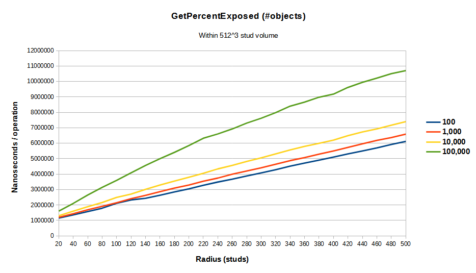

# GetPercentExposed
This benchmark measures the performance of Quenty's [GetPercentExposedUtils
module][GetPercentExposedUtils].

| Radius | 100     | 1,000   | 10,000  | 100,000  |
|-------:|--------:|--------:|--------:|---------:|
| 20     | 1148543 | 1200676 | 1297904 | 1600030  |
| 40     | 1359225 | 1433267 | 1597078 | 2101722  |
| 60     | 1576883 | 1684681 | 1888119 | 2645130  |
| 80     | 1791441 | 1909464 | 2159608 | 3141098  |
| 100    | 2110037 | 2146397 | 2490885 | 3593611  |
| 120    | 2328676 | 2404057 | 2706186 | 4081209  |
| 140    | 2433843 | 2626473 | 3012576 | 4562297  |
| 160    | 2630150 | 2862643 | 3295366 | 4994456  |
| 180    | 2842555 | 3093155 | 3547184 | 5407751  |
| 200    | 3045349 | 3294300 | 3792976 | 5846334  |
| 220    | 3277505 | 3541658 | 4051662 | 6322845  |
| 240    | 3485909 | 3741599 | 4336365 | 6601440  |
| 260    | 3670049 | 3996686 | 4563168 | 6925041  |
| 280    | 3880134 | 4202838 | 4820980 | 7303290  |
| 300    | 4076052 | 4407883 | 5053993 | 7617098  |
| 320    | 4286644 | 4640177 | 5308305 | 7979314  |
| 340    | 4512599 | 4872550 | 5564202 | 8400236  |
| 360    | 4713081 | 5065300 | 5794333 | 8662826  |
| 380    | 4905628 | 5291707 | 5996017 | 8979816  |
| 400    | 5103768 | 5500363 | 6202155 | 9181306  |
| 420    | 5307483 | 5730245 | 6491757 | 9614407  |
| 440    | 5500087 | 5959174 | 6732058 | 9942587  |
| 460    | 5695208 | 6181400 | 6927733 | 10218268 |
| 480    | 5919430 | 6366246 | 7170422 | 10502410 |
| 500    | 6114886 | 6590734 | 7399024 | 10703580 |

[GetPercentExposedUtils]: https://github.com/Quenty/NevermoreEngine/blob/ab3d7018e1b58f6642a03e4e676a3d5dadae5868/Modules/Shared/Physics/Explosions/GetPercentExposedUtils.lua
